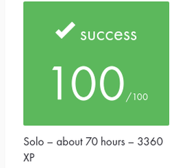

# Academic record and evaluation

This page records the academic context of **Philosophers** as completed within
the 42 Common Core and distinguishes that evaluated project from the later
maintained portfolio version of this repository.

## Project record

| Field | Record |
| --- | --- |
| Project | Philosophers |
| Curriculum | 42 Common Core |
| Score | 100/100 |
| Mode | Solo |
| Estimated workload | ~70 hours |
| XP | 3360 |
| Supplied subject | Philosophers — Version 13.0 |

## Evaluation evidence

The image above is a privacy-conscious crop of the original 42 project record.
It retains only the project-result information relevant to this portfolio:
score, project mode, estimated workload and XP.

## Subject provenance

The academic subject supplied for this portfolio review is **Philosophers,
Version 13.0**.

The original subject PDF is intentionally not redistributed in this repository.

The mandatory project centers on the Dining Philosophers concurrency problem
and requires, among other constraints:

- one philosopher represented by one thread;
- one mutex per fork;
- synchronization of shared state with mutexes;
- avoidance of data races;
- monitoring of philosopher death conditions;
- serialized and correctly timed status reporting.

The subject also defines an optional bonus implementation using processes and
semaphores. The maintained portfolio repository documents the mandatory
pthread-and-mutex implementation and does not claim completion of the historical
bonus project.

## Academic and maintained states

The project was completed and evaluated as part of the 42 Common Core.

The current `main` branch is a later maintained portfolio state. It includes
post-project engineering work such as correctness hardening, regression
validation, CI, documentation improvements and repository-structure cleanup.

The annotated tag:

`portfolio-baseline-2026-08`

preserves the repository state immediately before the professional portfolio
modernization work began.

That baseline is historical provenance for the repository, but it is not
presented as proof that the tagged commit is the exact commit evaluated by 42.

Likewise, the current maintained repository layout is not presented as the
literal historical 42 submission layout. Git history and the immutable baseline
preserve that distinction.
